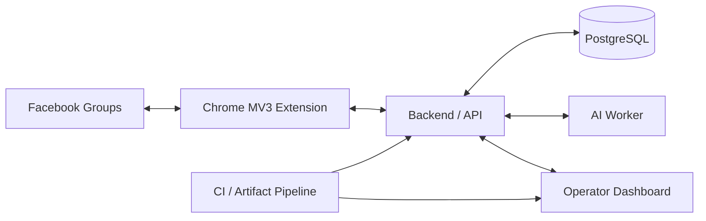

> **Visual overview:** conceptual case-study artwork based on the system architecture. It does not represent live customer, account, or moderation data.

# FB Groups — AI Moderation & Market Intelligence Platform

**Public engineering case study by [Levent Aydin](https://github.com/LEVENT-AY)**  
Senior Full-Stack, Mobile & AI Automation Engineer

> Proprietary source code, credentials, account identities, and sensitive runtime details remain private. This repository documents the engineering architecture, operating model, and design decisions only.

## At a glance

| | |
|---|---|
| **Product type** | AI-assisted moderation and market-intelligence platform |
| **Primary surfaces** | Chrome MV3 extension · Backend/API · AI worker · Operator dashboard |
| **Data layer** | PostgreSQL |
| **Engineering focus** | Browser automation · AI workflows · operational safety · CI/CD |
| **My role** | Product architecture, automation workflows, backend/AI integration, operations, delivery and verification |

## The engineering problem

Automating work against a third-party web interface is not the same as building a normal CRUD application. A server can be healthy while the wrong browser extension is loaded. A command can be queued while the browser never executes it. A browser can click an action while the external platform does not actually accept the resulting state.

FB Groups was designed around that reality: **observation, policy, execution, runtime identity and external acceptance are separate facts** and must be verified independently.

## Architecture

## What I built and owned

- Chrome Manifest V3 workflows for bounded observation and reviewed execution transport.
- Backend/API state for moderation, market-source ingestion, policy decisions and command lifecycle.
- Dedicated AI-worker integration for analysis and decision-support workflows.
- Operator dashboard for command state, runtime visibility and operational review.
- PostgreSQL-backed durable operational state.
- Explicit separation between Git source, built extension, loaded browser runtime, deployed services and external-platform acceptance.
- Fail-closed execution when runtime identity or evidence is uncertain.
- Scheduling and exclusion boundaries that prevent competing automated browser work.
- Immutable-artifact CI/CD with guarded delivery, runtime-scope classification and rollback-minded operations.

## Core engineering decisions

### 1. Browser state is not server state

A successful backend deployment cannot prove which extension build Chrome is running. The system therefore treats browser identity as its own evidence domain.

### 2. Internal success is not external success

Queue state, API status and CI results are useful internal evidence, but none of them can prove that the external platform accepted an action. Acceptance is verified at the boundary where the truth actually exists.

### 3. Automation must remain bounded

Automatic work does not receive unrestricted authority. Execution is coordinated through ownership, exclusion and safety boundaries, with operator-controlled acceptance where external UI state matters.

### 4. Production delivery must be reproducible

Heavy verification produces immutable artifacts. Production consumes the exact verified artifact rather than rebuilding ad hoc on the production host.

## Technology / systems

| Area | Focus |
|---|---|
| Browser automation | Chrome MV3, controlled observation, reviewed execution |
| Backend | API services, workflow state, command lifecycle |
| AI | Analysis worker, moderation and market-intelligence support |
| Data | PostgreSQL operational state |
| UI | Operator dashboard and runtime visibility |
| Delivery | CI/CD, immutable artifacts, guarded deployment |
| Safety | Fail-closed execution, evidence separation, operator control |

## What this demonstrates

This project demonstrates my ability to design and operate **AI-assisted automation around an unreliable external interface** while preserving clear safety, verification and production boundaries. It combines browser engineering, backend state, AI services, operational UX and deployment discipline in one system.

---

**Source policy:** private for commercial, operational, security and platform-safety reasons. No proprietary source code, credentials, private infrastructure details or account/group identities are published here.

[← Back to my engineering profile](https://github.com/LEVENT-AY)
