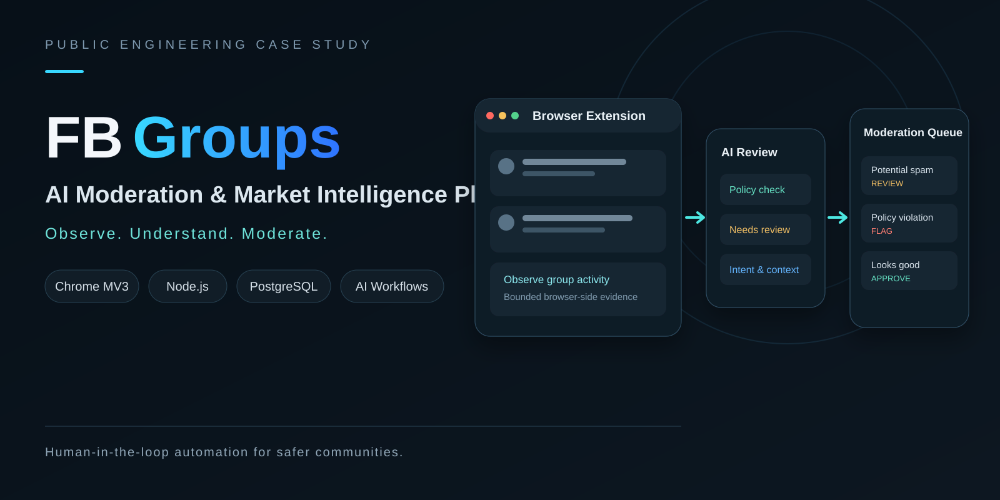
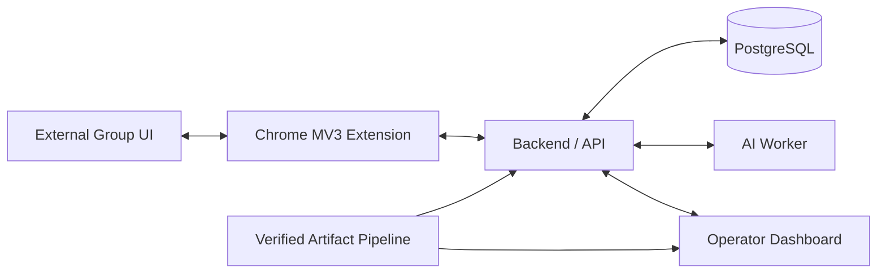

> **Visual overview:** conceptual case-study artwork based on the system architecture. It does not represent live customer, account, or moderation data.

# FB Groups — AI Moderation & Market Intelligence Platform

**Public engineering case study by [Levent Aydin](https://github.com/LEVENT-AY)**  
Senior Full-Stack, Mobile & AI Automation Engineer

> Proprietary source code, credentials, account identities, and sensitive runtime details remain private. This repository documents the engineering architecture, operating model, and design decisions only.

## 30-second recruiter scan

- **System:** AI-assisted moderation and market-intelligence platform spanning a Chrome MV3 extension, backend/API, AI worker, operator dashboard, and PostgreSQL state.
- **My ownership:** architecture, browser automation workflows, backend/AI integration, operational safety boundaries, runtime verification, and production delivery.
- **What it proves:** I can design AI-assisted automation around an unreliable third-party UI without confusing internal system state with external-platform truth.

## At a glance

| | |
|---|---|
| **Primary surfaces** | Chrome MV3 · Backend/API · AI worker · Operator dashboard |
| **Data** | PostgreSQL |
| **Focus** | Browser automation · AI workflows · operational safety · CI/CD |

## The engineering problem

Automating work against a third-party web interface is not the same as building a normal CRUD application. A server can be healthy while the wrong browser extension is loaded; a command can be queued while the browser never executes it; and a browser action still does not prove that the external platform accepted the resulting state.

FB Groups is designed around that reality: **observation, policy, execution, runtime identity, and external acceptance are separate facts**.

## Architecture

## What I built and owned

- Chrome Manifest V3 workflows for bounded observation and reviewed execution transport.
- Backend/API state for moderation, market-source ingestion, policy decisions, and command lifecycle.
- Dedicated AI-worker integration for analysis and decision-support workflows.
- Operator dashboard for command state, runtime visibility, and operational review.
- Fail-closed execution when runtime identity or evidence is uncertain.
- Immutable-artifact CI/CD with guarded delivery and rollback-minded operations.

## Key engineering decisions

### Browser state is not server state
A successful backend deployment cannot prove which extension build the browser is running, so browser identity is treated as its own evidence domain.

### Internal success is not external success
Queue state, API status, and CI results are internal evidence. External acceptance is verified only at the boundary where that truth exists.

### Automation stays bounded
Automatic work does not receive unrestricted authority. Execution is coordinated through ownership, exclusion, and operator-controlled safety boundaries.

## Technology

| Area | Focus |
|---|---|
| Browser | Chrome MV3, controlled observation, reviewed execution |
| Backend | API services, workflow state, command lifecycle |
| AI | Analysis worker, moderation and market-intelligence support |
| Data | PostgreSQL operational state |
| Delivery | CI/CD, immutable artifacts, guarded deployment |

## What this demonstrates

This project demonstrates browser engineering, backend state design, AI-assisted operations, production verification, and safety-oriented automation in one system.

---

**Source policy:** private for commercial, operational, security, and platform-safety reasons. No proprietary source code, credentials, private infrastructure details, or account/group identities are published here.

[← Back to my engineering profile](https://github.com/LEVENT-AY)
